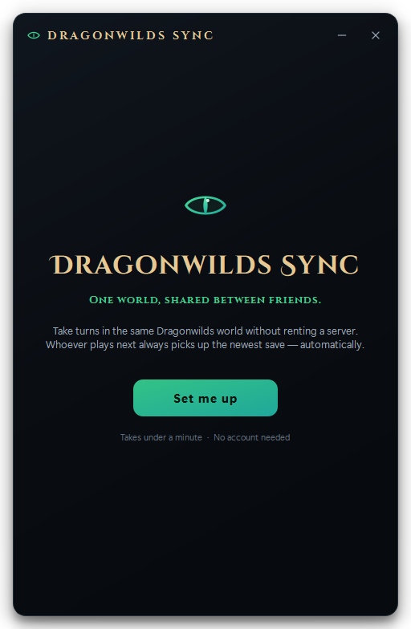
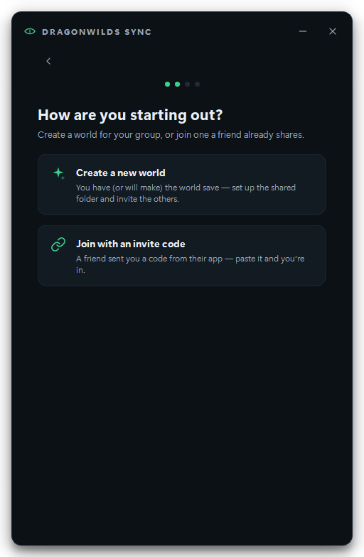
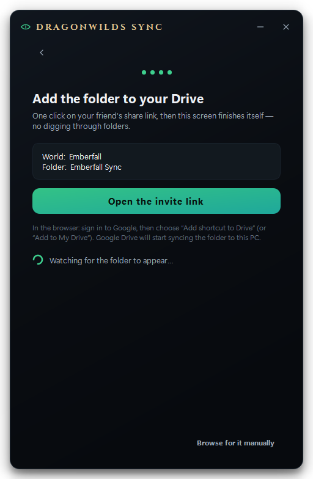
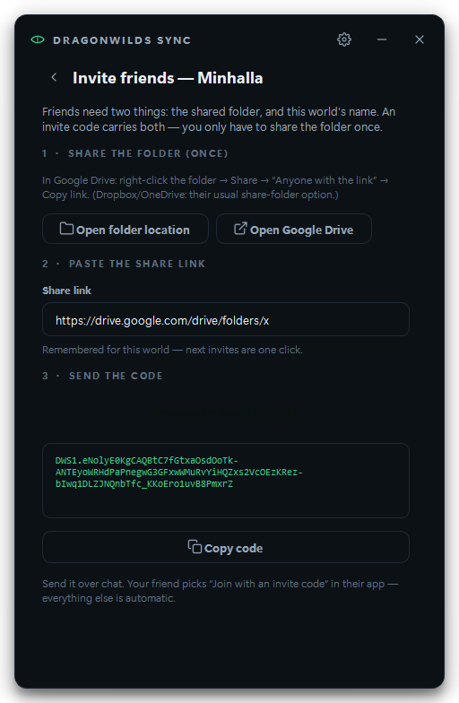
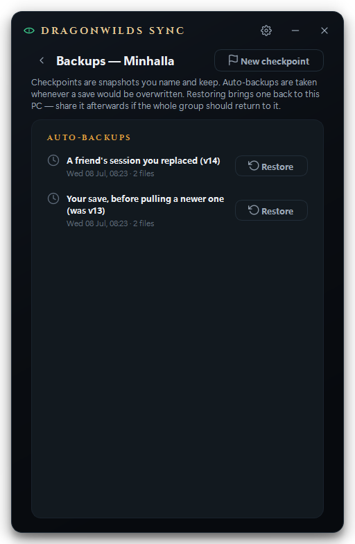

# Design rationale

*(v1.2 redesign notes at the very bottom; v1.1 additions below that; the v1.0
rationale still holds underneath.)*

## Stack: Python + PySide6 (Qt), PyInstaller

Three things decided it:

1. **The sync logic was already validated in Python.** Tauri/Electron would
   have meant rewriting exactly the code that was tested and correct. With
   Qt, `app/core/sync.py` is a near-verbatim port of the prototype, and the
   pytest suite pins its behavior.
2. **Qt gives full visual control** — frameless window, custom titlebar,
   real hover/pressed states, animated spinner and in-game pulse, toasts,
   an in-window modal overlay. None of that is reachable in Tkinter.
3. **PyInstaller reliably produces one double-clickable `.exe`** (44 MB,
   windowed, icon embedded). No runtime, no dependencies, no console window,
   ever. `installer.iss` is included for an optional Inno Setup wizard, but
   the bare exe is already zero-friction.

## Visual identity

- **Obsidian + dragonfire.** Near-black blue-green base (`#0C1116`), one
  emerald accent (`#3ECF8E → #1FA89B` gradient) used only for the identity
  and the primary action. Amber is reserved for "attention" (new save,
  warnings), red strictly for destructive choices. Nothing else gets color —
  that's what keeps it calm.
- **The mark is a dragon's eye** — almond outline, slit pupil, one glint —
  on a rounded-square badge. Fantasy at a glance, but geometric enough to
  sit next to Linear/Raycast without embarrassment. Generated at all icon
  sizes by `tools/generate_icon.py`.
- **Typography:** Segoe UI Variable with a spaced small-caps wordmark in the
  titlebar; 19px headline / 12.5px secondary rhythm everywhere else.
- **Frameless window** with custom titlebar, 14px radius, soft drop shadow;
  fixed launcher-size (512×784) because a relay tool has exactly one job.

## The screens

- **Onboarding** (4 short steps, under a minute): welcome → name → world
  (save folder pre-filled, worlds auto-detected from `.sav` files) → shared
  folder (detected cloud drives offered as one-click chips, folder created
  on the spot). Inline validation, no dialogs.
- **Main screen** is a hierarchy of exactly three things: a status hero
  ("You're up to date" / "New save from Elise" with version + relative
  time), a big gradient **PLAY** button with a hover glow, and the session
  feed (avatar initials, who shared which version, when). A footer dot
  quietly confirms the shared folder is reachable. During a session the
  hero morphs through checking → launching → in-game (breathing dot) →
  sharing, and the Play button narrates the same phases.
- **Settings** is the onboarding form on one page, plus "Open log folder".
- **Toasts** (bottom, auto-dismiss, click to close) carry all routine
  feedback. The **only blocking UI** is the overwrite confirmation — a
  full-window dim with the safe choice focused and the destructive one in
  red. It appears in exactly three cases: pulling over unshared local
  progress, sharing over someone's newer session, and quitting the app
  mid-game.

## Protocol notes (vs. the prototype)

Unchanged: manifest schema, version counter, `{world}*` file copying,
hash-based conflict detection, pull-before-play / push-after-quit flow.

Additions, all protocol-compatible:

- `version.json` also carries a capped `history` list → powers the session
  feed for everyone with old manifests still readable.
- The pull-side conflict check now has a **push-side mirror**: if someone
  shared while you were playing, sharing asks before replacing their
  session (the prototype only checked on pull).
- Anything about to be overwritten (either direction) is copied to
  `%APPDATA%\DragonwildsSync\backups` first (last 10 kept).
- Manifest writes are atomic (temp file + rename) so a cloud client never
  syncs a half-written `version.json`; a corrupt/deleted manifest can't
  reset the version counter backwards.

## v1.1 additions

**Invites.** The joining floor we can't remove without a full Google OAuth
integration is exactly one click ("Add shortcut to Drive"). Everything
around it is automated: the code (compressed JSON, `DWS1.` prefix, decoded
locally) carries world name + folder name + share link; the app opens the
link, then polls every cloud root on the machine until a folder with that
name (and a matching or absent manifest) appears, and finishes setup itself.
Honesty over magic: the join screen says out loud which click is yours.

**Multi-world.** Config schema v2 keeps `player_name`, save folder, and exe
global (one game install per machine) and gives each world its own shared
folder, share link, and webhook. The sync core still receives the same flat
v1-shaped dict it was validated against — `effective_cfg()` is the entire
boundary, which is how every v1.1 feature shipped without touching the
protocol code.

**Presence and turn claims** are advisory files (`playing.json` /
`next.json`) in the shared folder — stale-tolerant, fail-soft, and never a
substitute for the conflict checks; they just move the warning *before* the
session instead of after it.

**Feed as story.** Session notes, session lengths, and per-player
emblem/color ride as optional fields on existing history entries (amended
after push, whitelisted, never touching protocol fields). The feed is meant
to read like a campaign log, not a sync ledger.

## Screenshots

| | |
|---|---|
|  |  |
|  |  |
|  |  |
|  |  |

## v1.2 — the "wow" redesign + feature depth

**Brief:** the v1.1 UI was clean but read as "AI-made / generic dark
dashboard." The fix was atmosphere + a signature moment + character type,
landing on a *dark-fantasy game launcher* (game-launcher structure carrying
grimoire soul), plus the feature depth a friend group actually wants.

What moved the needle, in order of impact:

1. **A per-world hero banner.** The single biggest change: the top of the
   screen is now a moody, procedurally-painted landscape (`banner.py`) —
   moonlit ridge silhouettes, a soft halo, drifting embers — seeded from the
   world name and tinted by the world's colour, so every world is visually
   its own place. Painted with QPainter, zero image assets, animates gently.
   This is what flips it from "utility" to "companion to a game."
2. **Real display type.** Bundled Cinzel (roman caps — wordmark, headings,
   the all-caps status line), Cinzel Decorative (the big world name), and EB
   Garamond (italic session notes). Display-serif + clean-sans-body is the
   disciplined combination that reads premium without tipping into costume.
3. **An ember-gold accent** alongside the emerald: emerald stays the "go /
   play" colour, gold carries identity and flourish (wordmark, section
   labels, world title, update bar). Two purposeful colours, not a rainbow.
4. **A showpiece PLAY button** that breathes at rest and flares on hover, and
   gradient chrome with a vignette for depth.

Everything stayed inside PySide6/QPainter — no new heavyweight deps, exe grew
by ~1 MB (the fonts).

**Feature depth** was built as new core modules (`update`, `preflight`,
`health`, `statuspage`, `semver`, plus `presence`/`backups` extensions), each
unit-tested, with all save-integrity-adjacent logic (health gating, sync-state
checks, richer conflict detail) living in the controller *around* the frozen
sync core — never inside it. That boundary is why 30 features' worth of change
added zero risk to the one thing that must never regress.
