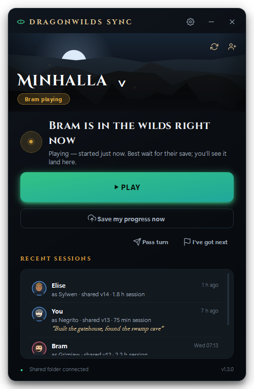
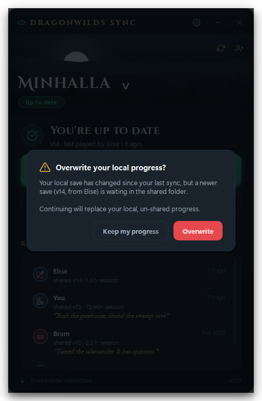

# Dragonwilds Sync

[](https://github.com/AndorManu/dragonwilds-sync/actions/workflows/tests.yml)
[](https://github.com/AndorManu/dragonwilds-sync/releases/latest)
[](LICENSE)


**Your world shouldn't need one PC.**

In *RuneScape: Dragonwilds* a world lives on the computer of whoever created
it. If that person isn't online, nobody else can play it. Dragonwilds Sync
moves the world into a shared cloud folder instead, so **anyone in the group
can host**: tonight you, tomorrow a friend, next week you alone for an hour.
Whoever presses Play always gets the newest save, and their progress goes
back to the group when they quit. No server, no subscription, nothing to
keep running.

Around that core: invite codes, live "who's playing", turn-passing with tray
pings, conflict detection in both directions, automatic backups, one-click
self-updates through the same folder, and a Characters page — all in a
dark-fantasy launcher that fits the game.

<p align="center">
  
  
  
</p>

## Download

Grab `DragonwildsSync.exe` from the **[latest release](https://github.com/AndorManu/dragonwilds-sync/releases/latest)**.
One file, no install, no Python, no account. Windows only (the game is).

SmartScreen will warn the first time because the exe isn't code-signed —
**More info → Run anyway**. The exe on every release is built by
[GitHub Actions](.github/workflows/release.yml) from the tagged source on a
clean runner, not on anyone's laptop; and if you'd rather not trust it at
all, the whole thing is Python — build it yourself in two commands (see below).

## How it works

Everyone in the group points the app at the **same shared folder** — any
folder inside a cloud drive that each of you syncs to your own PC (Google
Drive, Dropbox, OneDrive… the app doesn't care which, and nothing ever needs
a paid server).

- **Play** pulls the newest save, launches the game through Steam, and —
  once you close the game — shares your progress back automatically.
- A tiny `version.json` manifest tracks a version number, who played last,
  and when. Every share bumps the version; every pull checks it.
- If your local save changed without being shared *and* someone else has
  since shared a newer version, you get an unmissable warning before
  anything is overwritten — in **both** directions. Whatever gets replaced
  is backed up first (browse and restore under *world menu → Backups*).
- The app shows **who's playing right now**, lets you call **"I've got
  next"**, pings you from the tray when it's your turn, and can post to a
  Discord/Slack/ntfy **webhook** when someone shares a save.

## Joining a friend's world (the 60-second version)

1. Download `DragonwildsSync.exe` (see above, or take your friend's copy)
   and double-click it.
2. Type your name, pick **“Join with an invite code”**, paste the code your
   friend sent you.
3. The app opens their share link — sign in to Google and click
   **“Add shortcut to Drive”**. That's the one click we can't do for you.
4. Done. The app spots the folder as soon as Google Drive syncs it and drops
   you on the main screen. Hit **Play**.

You do need [Google Drive for desktop](https://www.google.com/drive/download/)
(or Dropbox/OneDrive) installed and signed in — the app tells you if it's
missing.

## Hosting a world & inviting friends

1. Pick **“Create a new world”** during setup: choose your world and a shared
   folder inside your cloud drive.
2. Hit **“Invite friends”** on the main screen. Share the folder once in the
   Drive UI (right-click → Share → *Anyone with the link* → Copy link),
   paste the link, and copy the generated invite code into your group chat.
3. Each friend follows the three steps above. New invites for the same world
   are one click — the link is remembered.

**House rule:** one person plays at a time. The app warns loudly (before
*and* after the fact) if two sessions collide, but the polite fix is a
message in the group chat.

## Keeping everyone on the latest version

No store, no manual re-sending of the exe:

1. Build the new `DragonwildsSync.exe` and run it yourself to test.
2. Settings → **Publish this version to friends**. The app copies itself into
   the shared folder's `_app` subfolder with a version manifest.
3. Everyone else's app notices the newer build (it's already syncing to their
   PC), shows an **Update** bar, and swaps itself in place on confirm — worlds
   and settings kept.

## Extras

- **Test my setup** (Settings) — a checklist that verifies folders, cloud
  sync, and game launch so setup problems are obvious, not mysterious.
- **Checkpoints** (world menu → Backups) — name a snapshot before something
  risky; restore it any time. Automatic backups are taken whenever a save
  would be overwritten.
- **Pass the turn** — hand a specific friend the world; they get a tray ping.
- **Phone status page** — with the toggle on, a `status.html` is written into
  the shared folder; open it from your phone's cloud-drive app to see who's
  playing without launching anything.

## Building from source

```powershell
git clone https://github.com/AndorManu/dragonwilds-sync.git
cd dragonwilds-sync
.\build.ps1        # creates .venv, runs tests, builds dist\DragonwildsSync.exe
```

That single `.exe` is the whole distribution — dropping it in the shared
folder works great. Optionally compile `installer.iss` with
[Inno Setup](https://jrsoftware.org/isinfo.php) for a setup wizard.

Development:

```powershell
python -m venv .venv
.\.venv\Scripts\pip install -r requirements.txt -r requirements-dev.txt
.\.venv\Scripts\python -m app                # run from source
.\.venv\Scripts\python -m pytest tests      # protocol + services test suite
.\.venv\Scripts\python tools\screenshots.py # re-render docs/screenshots
```

## Layout

```
app/
  core/        sync protocol, config schema, invites, presence, webhooks,
               backups, game launch/watch, cloud/Steam detection — no Qt
  ui/          theme, widgets, screens (PySide6)
  controller.py  worker threads in, Qt signals out
  main.py      entry point (--tray starts quietly in the tray)
tests/         pytest suite (184 tests)
tools/         icon generator, screenshot harness
```

## Why it's built this way

The sync core is deliberately small and boring: a `version.json` manifest,
a monotonic version counter, and content hashes compared on **both** pull
and push. Every overwrite is preceded by a backup, and every manifest write
is atomic (temp file + rename), so a cloud client dying mid-sync can't leave
a half-written state. The core has no Qt in it and is tested in isolation;
everything user-facing lives in a controller layer around it. Cloud drives
were chosen over a server on purpose — a group of friends already has one,
it's free, and there's nothing to host, patch, or pay for.

Per-user data lives in `%APPDATA%\DragonwildsSync\` (config, per-world state,
logs, safety backups). v1.0 configs migrate automatically; the originals are
kept as `config.v1.bak` / `state.v1.bak`.

## Security notes, honestly

- **Nothing leaves your PC except into the shared folder you chose.** No
  telemetry, no accounts, no calls to any server of mine (there isn't one).
  Webhooks and Discord presence are off unless you turn them on.
- **The shared folder is the trust boundary.** Anyone who can write to it can
  change the world save, and — because updates travel through the same
  folder — can publish an app update that everyone else's app will offer to
  install. Only share the folder with people you'd hand your save to anyway.
  The update bar always asks; it never auto-installs.
- **The exe isn't code-signed** (certificates cost money; this is a hobby
  project). Verify a release by building it yourself, or compare the exe's
  SHA-256 with the one printed in the GitHub Actions log of that release.
- **Save files are only ever replaced after a backup is written**, and the
  game's own `.backup` twin of each character file is never touched.

## Troubleshooting

- **“Shared folder not found”** — your cloud client isn't running or the
  folder moved; fix the path in Settings.
- **The newest save “hasn't finished syncing”** — the manifest arrived before
  the save files; give the cloud client a few seconds and hit refresh.
- **Joining: the folder never appears** — make sure you clicked *Add shortcut
  to Drive* (not just opened the link), and that Google Drive for desktop is
  running. “Browse for it manually” always works as a fallback.
- **Game never detected** — Steam sometimes takes ages; the app waits two
  minutes, then falls back to the manual save button.
- **App won't quit** — it lives in the tray by default so it can ping you;
  right-click the tray icon → Quit, or turn it off in Settings.
- Logs: **Settings → Open log folder**.

## Contributing

Issues and pull requests are welcome. Keep the sync core (`app/core/sync.py`)
boring: any change there needs a test in `tests/test_sync.py`, and the
protocol must stay readable by older versions (the manifest is plain JSON on
purpose). Run `python -m pytest tests` before opening a PR — CI runs the same
suite on Windows and Linux.

## Credits & license

- Code: [MIT](LICENSE). Built by Andor Danse.
- Fonts: Cinzel, Cinzel Decorative and EB Garamond, under the
  [SIL Open Font License](app/assets/fonts/OFL-Cinzel.txt).
- Item and unlock ID tables (`app/assets/*.json`) are derived from the
  community datamine in [PEAKEGames/DWCharacterEditor](https://github.com/PEAKEGames/DWCharacterEditor).
  No game assets are shipped; all icons and artwork in the app are drawn
  procedurally.
- *RuneScape: Dragonwilds* is a trademark of Jagex Ltd. This is an
  independent fan-made tool, not affiliated with or endorsed by Jagex.
