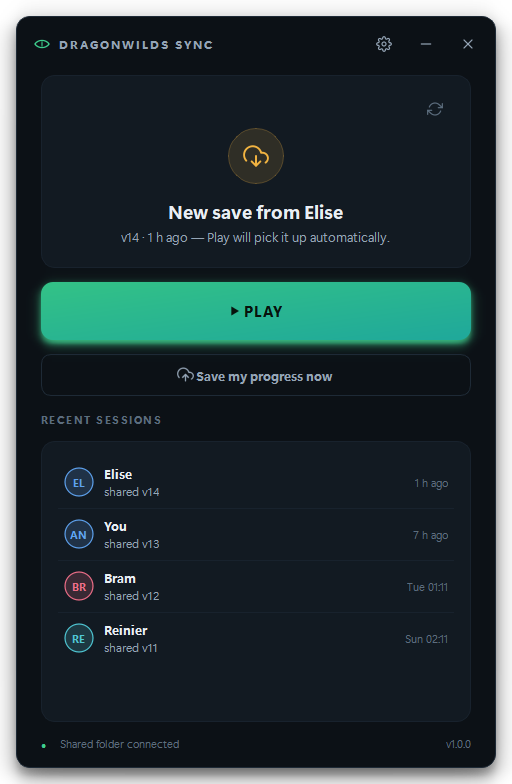

# Dragonwilds Sync

**One world, shared between friends.** Take turns playing the same
*RuneScape: Dragonwilds* world without renting a server — whoever plays next
always picks up the newest save, automatically.



## How it works

Everyone in the group points the app at the **same shared folder** — any
folder inside a cloud drive that each of you syncs to your own PC (Google
Drive, Dropbox, OneDrive… the app doesn't care which, and it never needs a
paid server).

- **Play** pulls the newest save from the shared folder, launches the game
  through Steam, and — once you close the game — shares your progress back
  automatically.
- A tiny `version.json` manifest in the shared folder tracks a version
  number, who played last, and when. Every share bumps the version; every
  pull checks it.
- If your local save changed without being shared (you played offline) *and*
  someone else has since shared a newer version, you get an unmissable
  warning before anything is overwritten — in **both** directions (pulling
  over your progress, or sharing over theirs). Whatever gets replaced is
  first backed up to `%APPDATA%\DragonwildsSync\backups`, just in case.

## For friends: using the app

1. Download `DragonwildsSync.exe` (from whoever built it — dropping it in the
   shared folder itself works great) and double-click it. No install, no
   Python, no account.
   - Windows SmartScreen may warn because the exe isn't code-signed. Click
     **More info → Run anyway**.
2. Answer three questions: your name, which world (auto-detected from your
   save folder), and the shared folder (the app suggests your OneDrive /
   Dropbox / Google Drive automatically).
3. From then on: open the app, hit **Play**. That's it. When you quit the
   game, your session is shared and the next person's Play picks it up.

If the app ever can't detect the game closing, the **“Save my progress
now”** button does the same thing manually.

**House rule:** one person plays at a time. The app warns loudly if two
sessions collide, but the polite fix is a message in the group chat.

## For the maintainer: building from source

```powershell
git clone <this repo>
cd dragonwilds-sync
.\build.ps1        # creates .venv, runs tests, builds dist\DragonwildsSync.exe
```

That single `.exe` is the whole distribution. Optionally, compile
`installer.iss` with [Inno Setup](https://jrsoftware.org/isinfo.php)
(`iscc installer.iss`) to get a `DragonwildsSync-Setup.exe` wizard with Start
Menu/Desktop shortcuts.

Development:

```powershell
python -m venv .venv
.\.venv\Scripts\pip install -r requirements.txt -r requirements-dev.txt
.\.venv\Scripts\python -m app          # run from source
.\.venv\Scripts\python -m pytest tests # sync-protocol test suite
.\.venv\Scripts\python tools\screenshots.py  # re-render docs/screenshots
```

## Layout

```
app/
  core/        sync protocol, game launch/watch, config, logging — no Qt
  ui/          theme, widgets, screens (PySide6)
  controller.py  worker threads in, Qt signals out
  main.py      entry point
tests/         pytest suite for the sync protocol
tools/         icon generator, screenshot harness
```

Per-user data lives in `%APPDATA%\DragonwildsSync\` (config, state, logs,
safety backups). Configs from the old CLI/Tkinter prototype
(`~/.dragonwilds_sync`) are migrated automatically on first run.

## Troubleshooting

- **“Shared folder not found”** — your cloud client isn't running or the
  folder moved; fix the path in Settings.
- **The newest save “hasn't finished syncing”** — the manifest arrived
  before the save files; give the cloud client a few seconds and hit the
  refresh arrow.
- **Game never detected** — Steam sometimes takes ages; the app waits two
  minutes, then falls back to the manual save button.
- Logs: **Settings → Open log folder** (or
  `%APPDATA%\DragonwildsSync\logs`).
