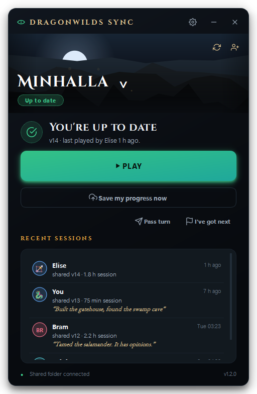

# Dragonwilds Sync

**One world, shared between friends.** Take turns playing the same
*RuneScape: Dragonwilds* world without renting a server — whoever plays next
always picks up the newest save, automatically. A dark-fantasy launcher for
your group's shared world, with invites, presence, backups, and one-click
updates — all through your own cloud drive, no server anywhere.



## How it works

Everyone in the group points the app at the **same shared folder** — any
folder inside a cloud drive that each of you syncs to your own PC (Google
Drive, Dropbox, OneDrive… the app doesn't care which, and nothing ever needs
a paid server).

- **Play** pulls the newest save, launches the game through Steam, and —
  once you close the game — shares your progress back automatically.
- A tiny `version.json` manifest tracks a version number, who played last,
  and when. Every share bumps the version; every pull checks it.
- If your local save changed without being shared *and* someone else has
  since shared a newer version, you get an unmissable warning before
  anything is overwritten — in **both** directions. Whatever gets replaced
  is backed up first (browse and restore under *world menu → Backups*).
- The app shows **who's playing right now**, lets you call **"I've got
  next"**, pings you from the tray when it's your turn, and can post to a
  Discord/Slack/ntfy **webhook** when someone shares a save.

## Joining a friend's world (the 60-second version)

1. Get `DragonwildsSync.exe` from your friend and double-click it.
   No install, no Python, no account.
   - SmartScreen may warn because the exe isn't code-signed:
     **More info → Run anyway**.
2. Type your name, pick **“Join with an invite code”**, paste the code your
   friend sent you.
3. The app opens their share link — sign in to Google and click
   **“Add shortcut to Drive”**. That's the one click we can't do for you.
4. Done. The app spots the folder as soon as Google Drive syncs it and drops
   you on the main screen. Hit **Play**.

You do need [Google Drive for desktop](https://www.google.com/drive/download/)
(or Dropbox/OneDrive) installed and signed in — the app tells you if it's
missing.

## Hosting a world & inviting friends

1. Pick **“Create a new world”** during setup: choose your world and a shared
   folder inside your cloud drive.
2. Hit **“Invite friends”** on the main screen. Share the folder once in the
   Drive UI (right-click → Share → *Anyone with the link* → Copy link),
   paste the link, and copy the generated invite code into your group chat.
3. Each friend follows the three steps above. New invites for the same world
   are one click — the link is remembered.

**House rule:** one person plays at a time. The app warns loudly (before
*and* after the fact) if two sessions collide, but the polite fix is a
message in the group chat.

## Keeping everyone on the latest version

No store, no manual re-sending of the exe:

1. Build the new `DragonwildsSync.exe` and run it yourself to test.
2. Settings → **Publish this version to friends**. The app copies itself into
   the shared folder's `_app` subfolder with a version manifest.
3. Everyone else's app notices the newer build (it's already syncing to their
   PC), shows an **Update** bar, and swaps itself in place on confirm — worlds
   and settings kept.

## Extras

- **Test my setup** (Settings) — a checklist that verifies folders, cloud
  sync, and game launch so setup problems are obvious, not mysterious.
- **Checkpoints** (world menu → Backups) — name a snapshot before something
  risky; restore it any time. Automatic backups are taken whenever a save
  would be overwritten.
- **Pass the turn** — hand a specific friend the world; they get a tray ping.
- **Phone status page** — with the toggle on, a `status.html` is written into
  the shared folder; open it from your phone's cloud-drive app to see who's
  playing without launching anything.

## For the maintainer: building from source

```powershell
git clone <this repo>
cd dragonwilds-sync
.\build.ps1        # creates .venv, runs tests, builds dist\DragonwildsSync.exe
```

That single `.exe` is the whole distribution — dropping it in the shared
folder works great. Optionally compile `installer.iss` with
[Inno Setup](https://jrsoftware.org/isinfo.php) for a setup wizard.

Development:

```powershell
python -m venv .venv
.\.venv\Scripts\pip install -r requirements.txt -r requirements-dev.txt
.\.venv\Scripts\python -m app                # run from source
.\.venv\Scripts\python -m pytest tests      # protocol + services test suite
.\.venv\Scripts\python tools\screenshots.py # re-render docs/screenshots
```

## Layout

```
app/
  core/        sync protocol, config schema, invites, presence, webhooks,
               backups, game launch/watch, cloud/Steam detection — no Qt
  ui/          theme, widgets, screens (PySide6)
  controller.py  worker threads in, Qt signals out
  main.py      entry point (--tray starts quietly in the tray)
tests/         pytest suite (52 tests)
tools/         icon generator, screenshot harness
```

Per-user data lives in `%APPDATA%\DragonwildsSync\` (config, per-world state,
logs, safety backups). v1.0 configs migrate automatically; the originals are
kept as `config.v1.bak` / `state.v1.bak`.

## Troubleshooting

- **“Shared folder not found”** — your cloud client isn't running or the
  folder moved; fix the path in Settings.
- **The newest save “hasn't finished syncing”** — the manifest arrived before
  the save files; give the cloud client a few seconds and hit refresh.
- **Joining: the folder never appears** — make sure you clicked *Add shortcut
  to Drive* (not just opened the link), and that Google Drive for desktop is
  running. “Browse for it manually” always works as a fallback.
- **Game never detected** — Steam sometimes takes ages; the app waits two
  minutes, then falls back to the manual save button.
- **App won't quit** — it lives in the tray by default so it can ping you;
  right-click the tray icon → Quit, or turn it off in Settings.
- Logs: **Settings → Open log folder**.
