<div align="center">

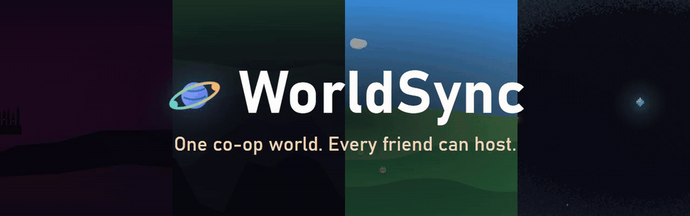

<br>

<a href="https://github.com/AndorManu/worldsync/releases/latest"></a>
<a href="#supported-games"></a>
<a href="https://github.com/AndorManu/worldsync/actions/workflows/tests.yml"></a>
<a href="LICENSE"></a>

### Take turns hosting one co-op world through the cloud drive your group already has.
No server. No subscription. Free and open source.

<a href="#supported-games"><b>Games</b></a> ·
<a href="#how-it-works"><b>How it works</b></a> ·
<a href="#features"><b>Features</b></a> ·
<a href="#download"><b>Download</b></a> ·
<a href="#faq"><b>FAQ</b></a> ·
<a href="docs/GAMES.md"><b>Setup per game</b></a>

</div>

<br>

In most survival games a world lives on the PC of whoever created it. If that
person isn't online, nobody else can play it. **WorldSync** keeps the world in
a shared cloud folder instead, so **anyone in the group can host**: tonight
you, tomorrow a friend, next week you alone for an hour. Whoever presses Play
gets the newest save, and their progress goes back to the group when they quit.

<div align="center">
  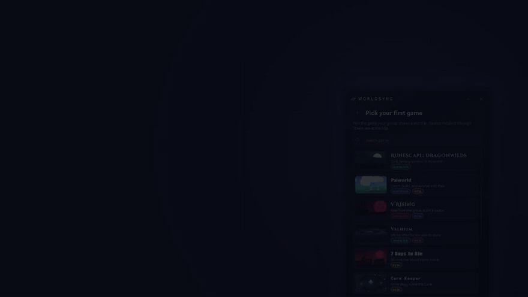
</div>

<br>

## Supported games

<table>
  <tr>
    <td width="50%"><a href="docs/GAMES.md#valheim">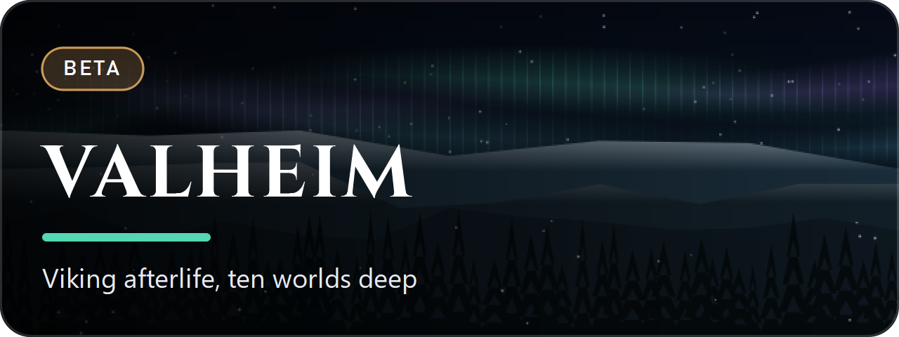</a></td>
    <td width="50%"><a href="docs/GAMES.md#v-rising">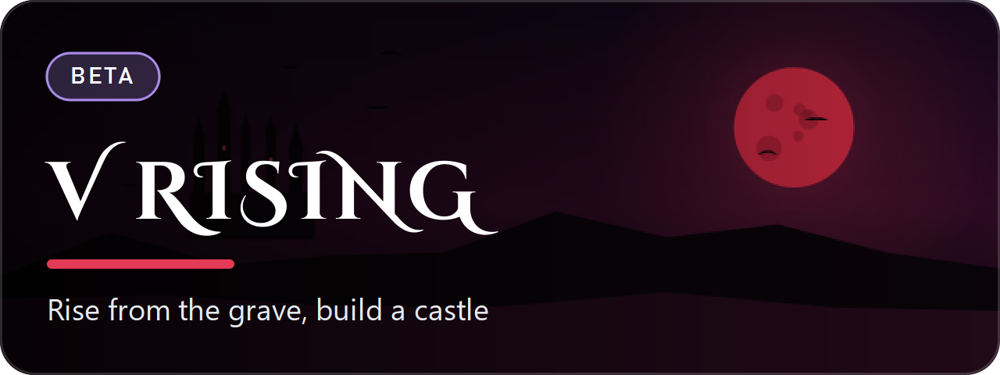</a></td>
  </tr>
  <tr>
    <td><a href="docs/GAMES.md#palworld">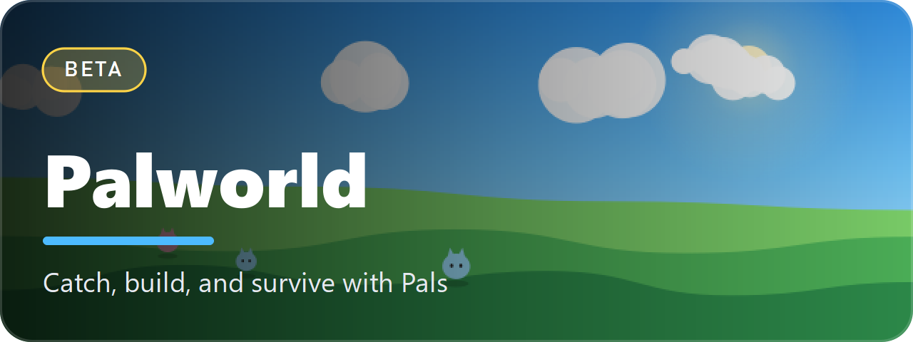</a></td>
    <td><a href="docs/GAMES.md#enshrouded">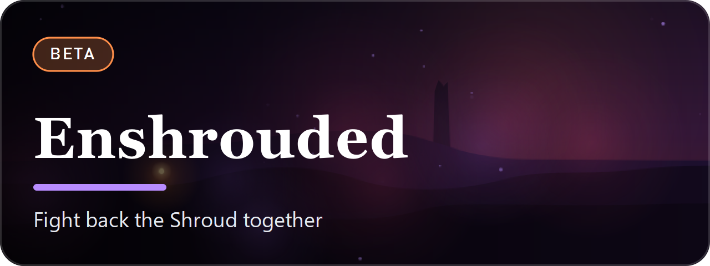</a></td>
  </tr>
  <tr>
    <td><a href="docs/GAMES.md#runescape-dragonwilds">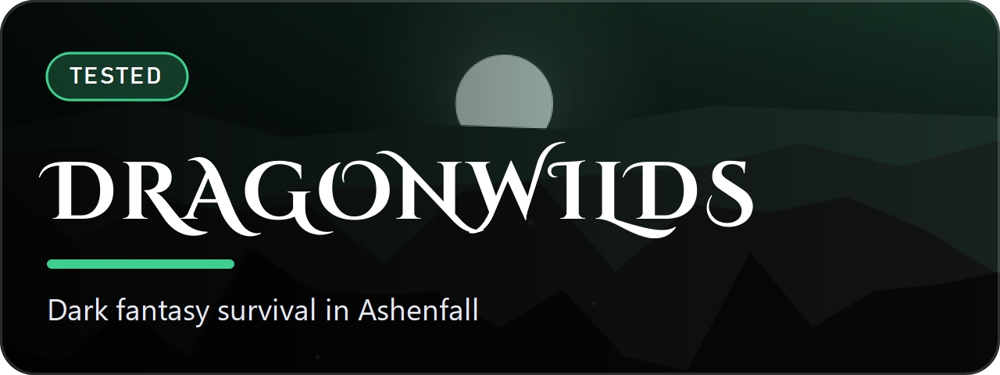</a></td>
    <td><a href="docs/GAMES.md#core-keeper">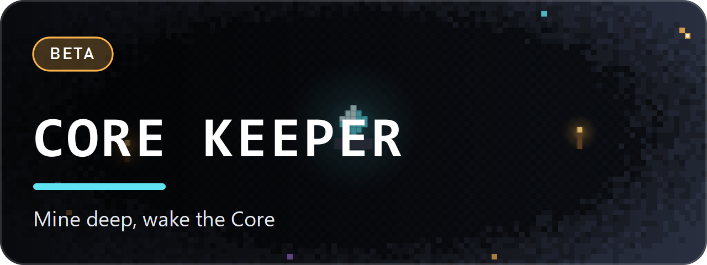</a></td>
  </tr>
  <tr>
    <td><a href="docs/GAMES.md#sons-of-the-forest">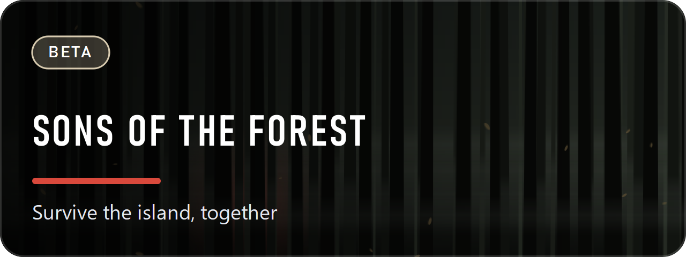</a></td>
    <td><a href="docs/GAMES.md#7-days-to-die">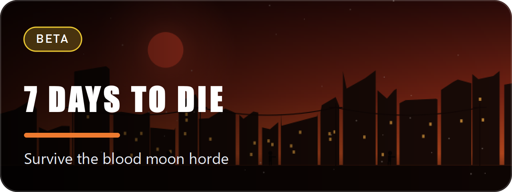</a></td>
  </tr>
  <tr>
    <td><a href="docs/GAMES.md#grounded">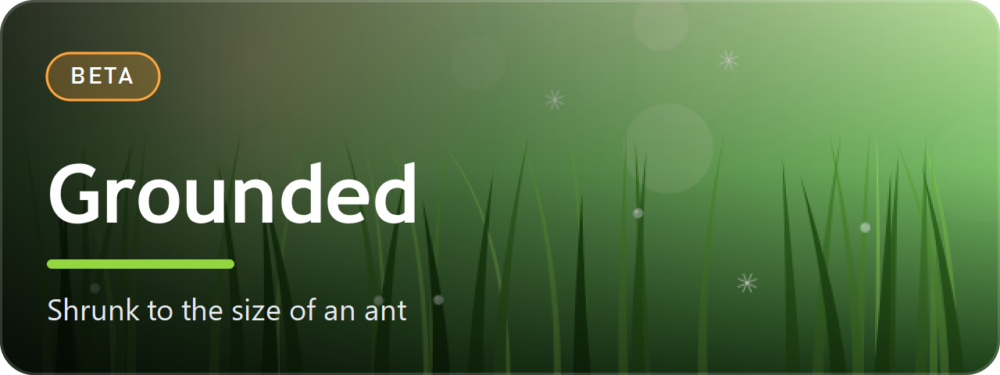</a></td>
    <td><a href="docs/GAMES.md#raft">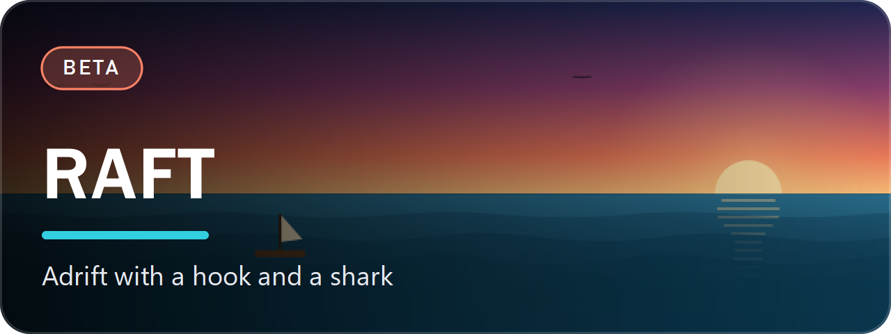</a></td>
  </tr>
</table>

<p align="center">
Click a game for its setup guide, or <a href="https://github.com/AndorManu/worldsync/issues/new?labels=game-request&title=Game+request:+"><b>ask for the next one</b></a>.
</p>

**Tested** means proven with real groups. **Beta** means the save layout comes
from community guides and WorldSync's own tests, but hasn't had a full season
of real groups yet. Every overwrite is backed up first, so a surprise costs you
a restore, not a world.

<details>
<summary><b>Good to know, per game</b></summary>
<br>

| Game | Status | Good to know |
|---|---|---|
| RuneScape: Dragonwilds | Tested | Where WorldSync started. Also gets a Characters page. |
| Valheim | Beta | Worlds in Steam Cloud need *Manage Saves → Move to Local* first. Characters stay on each PC. |
| Enshrouded | Beta | If you use Steam Cloud saves, point WorldSync at `Steam\userdata` during setup. |
| Palworld | Beta | Palworld ties the host's character to the host's PC; the original host can look reset when someone else hosts. Everyone else keeps theirs. |
| Core Keeper | Beta | Worlds are stored by slot, so the group shares the same slot number. |
| Sons of the Forest | Beta | The host's inventory lives in the save, so whoever hosts carries it. |
| V Rising | Beta | Every vampire is stored per Steam account, so everyone keeps their own. |
| Grounded | Beta | Steam version only; Game Pass saves sit in a protected folder. |
| Raft | Beta | |
| 7 Days to Die | Beta | A random-gen map travels with the save the first time (a few hundred MB). |

The full step-by-step guide is in [docs/GAMES.md](docs/GAMES.md), and the same guide is in the app under the world menu.

</details>

## How it works

<div align="center">
  
</div>

<br>

<table>
  <tr>
    <td align="center" valign="top" width="25%"><h3>1</h3><b>Add a game</b><br><sub>The picker lists your Steam games first.</sub></td>
    <td align="center" valign="top" width="25%"><h3>2</h3><b>Pick the world</b><br><sub>Found in the game's save folder, newest first. No digging in AppData.</sub></td>
    <td align="center" valign="top" width="25%"><h3>3</h3><b>Pick a shared folder</b><br><sub>Inside Google Drive, Dropbox or OneDrive. Any of them works.</sub></td>
    <td align="center" valign="top" width="25%"><h3>4</h3><b>Invite friends</b><br><sub>One code carries the game, the world and the folder.</sub></td>
  </tr>
</table>

From then on, **Play** pulls the newest save, launches the game through Steam,
and shares your progress back when you close it. A small `version.json` in the
shared folder tracks a version number, who played last and when. If your save
changed without being shared *and* a friend has shared a newer one since, you
get a clear warning before anything is overwritten, in **both** directions.

> **House rule:** one person plays at a time. The app warns loudly (before
> *and* after the fact) if two sessions collide, but the polite fix is a
> message in the group chat.

## Features

<table>
  <tr>
    <td width="33%" valign="top"><br><b>Anyone can host</b><br><sub>The world isn't stuck on one PC. Whoever's online plays the newest save.</sub></td>
    <td width="33%" valign="top"><br><b>Your own cloud</b><br><sub>Google Drive, Dropbox or OneDrive. Nothing to rent, nothing to keep running.</sub></td>
    <td width="33%" valign="top"><br><b>Conflict-safe</b><br><sub>Checks both directions before overwriting, and refuses to mix up games.</sub></td>
  </tr>
  <tr>
    <td valign="top"><br><b>Backups and checkpoints</b><br><sub>A backup before every overwrite, named checkpoints, and group history in the shared folder.</sub></td>
    <td valign="top"><br><b>One-code invites</b><br><sub>Friends paste a code, add the folder to their drive, done.</sub></td>
    <td valign="top"><br><b>Who's playing, live</b><br><sub>Presence, "I've got next", turn passing with tray pings, Discord/Slack/ntfy webhooks.</sub></td>
  </tr>
  <tr>
    <td valign="top"><br><b>One-click updates</b><br><sub>Publish a new build to the shared folder; friends get an Update bar.</sub></td>
    <td valign="top"><br><b>Every game its own look</b><br><sub>Valheim's aurora, V Rising's blood moon, a pixel cave for Core Keeper. All drawn by the app.</sub></td>
    <td valign="top"><br><b>Free and open source</b><br><sub>MIT licensed. Every release is built by GitHub Actions from the public source.</sub></td>
  </tr>
</table>

<details>
<summary><b>More extras</b></summary>
<br>

- **Test my setup** (Settings) - a checklist for folders, cloud sync and game launch, so setup problems are obvious, not mysterious.
- **"Did it work?"** - after a game's first share, one click tells the maintainer whether it worked for you (only while reports are on).
- **Pass the turn** - hand a specific friend the world; they get a tray ping.
- **Phone status page** - a `status.html` in the shared folder shows who's playing, readable from your phone's cloud-drive app.
- **Keeping everyone up to date** - run the new build yourself, then *Settings → Publish this version to friends*. Everyone else's app shows an **Update** bar and swaps itself in place on confirm. Worlds and settings are kept.

</details>

<p align="center">
  
  
  
</p>

## Download

<div align="center">

<a href="https://github.com/AndorManu/worldsync/releases/latest/download/WorldSync.exe"></a>

<sub>One file. No install, no Python, no account. Windows 10 and 11.</sub>

<sub>Also on <a href="https://andy69987.itch.io/worldsync">itch.io</a>.</sub>

</div>

SmartScreen will warn the first time because the exe isn't code-signed:
**More info → Run anyway**. The exe on every release is built by
[GitHub Actions](.github/workflows/release.yml) from the tagged source on a
clean runner, not on anyone's laptop. If you'd rather not trust it at all,
[build it yourself](#building-from-source) in two commands.

**Coming from Dragonwilds Sync?** Just run WorldSync. Your worlds, settings,
backups and invite codes carry over on first start, and friends still on
Dragonwilds Sync 1.x can keep joining your Dragonwilds worlds.

## FAQ

<details>
<summary><b>Isn't this what dedicated servers are for?</b></summary>
<br>

Yes, if your group plays together often enough to justify one. A dedicated
server needs a machine running 24/7 (yours, or roughly €5-15 a month rented)
and someone to keep it updated in step with the game. WorldSync is for the
other kind of group: three to five friends who play a couple of evenings a
week, rarely all at once, and don't want a bill or a box to maintain.
Nothing runs when nobody's playing; the world is just files in a folder you
already have.

</details>

<details>
<summary><b>Doesn't Steam Cloud already do this?</b></summary>
<br>

Steam Cloud syncs *your* saves between *your* PCs, not between friends.
There are also paid tools that do something similar through their own cloud.
WorldSync is free, the code is public, and your saves never touch anyone's
server but the cloud drive you already use.

</details>

<details>
<summary><b>What does WorldSync send, and where? (privacy and security, honestly)</b></summary>
<br>

- **Anonymous reports are on by default, and one checkbox in Settings turns
  them off.** Apart from those, nothing leaves your PC except into the shared
  folder you chose. A report says which game, whether a share, pull or launch
  worked, the app version and Windows version, under a random id made on your
  PC. Never your name, world names, folders, invite codes or saves. It's how
  beta games get fixed and marked tested. The exact list of fields is in
  [`app/core/telemetry.py`](app/core/telemetry.py), and a test checks that
  nothing else gets through. Plain-language details, retention (12 months) and
  how to erase your reports: [PRIVACY.md](PRIVACY.md). No accounts. Webhooks
  and Discord presence are off unless you turn them on.
- **The shared folder is the trust boundary.** Anyone who can write to it can
  change the world save, and, because updates travel through the same folder,
  can publish an app update that everyone else's app will offer to install.
  Only share the folder with people you'd hand your save to anyway. The update
  bar always asks; it never auto-installs.
- **The exe isn't code-signed** (certificates cost money; this is a hobby
  project). Verify a release by building it yourself, or compare the exe's
  SHA-256 with the one printed in the GitHub Actions log of that release.
- **Save files are only ever replaced after a backup is written.**

</details>

<details>
<summary><b>Something isn't working</b></summary>
<br>

- **"Shared folder not found"** - your cloud client isn't running or the
  folder moved; fix the path in Settings.
- **The newest save "hasn't finished syncing"** - the manifest arrived before
  the save files; give the cloud client a few seconds and hit refresh.
- **No worlds found** - start the game once and create or load the world,
  then browse to the save folder if WorldSync still can't see it.
- **Joining: the folder never appears** - make sure you clicked *Add shortcut
  to Drive* (not just opened the link), and that Google Drive for desktop is
  running. "Browse for it manually" always works as a fallback.
- **Game never detected** - Steam sometimes takes ages; the app waits two
  minutes, then falls back to the manual save button.
- Logs: **Settings → Open log folder**. Still stuck? [Open an issue](https://github.com/AndorManu/worldsync/issues) with the newest log attached.

</details>

## For developers

### Building from source

```powershell
git clone https://github.com/AndorManu/worldsync.git
cd worldsync
.\build.ps1        # creates .venv, runs tests, builds dist\WorldSync.exe
```

<details>
<summary><b>Development setup</b></summary>
<br>

```powershell
python -m venv .venv
.\.venv\Scripts\pip install -r requirements.txt -r requirements-dev.txt
.\.venv\Scripts\python -m app                 # run from source
.\.venv\Scripts\python -m pytest tests       # the test suite
.\.venv\Scripts\python tools\screenshots.py  # re-render docs/screenshots
.\.venv\Scripts\python tools\readme_cards.py # re-render the README game cards
```

</details>

### Adding a game

A game is a single entry in [`app/core/games.py`](app/core/games.py): where
it keeps its saves, how to tell worlds apart, which files make up a world,
and the exe to watch for.

```python
GameProfile(
    id="raft", name="Raft", steam_app_id="648800",
    process_names=("Raft.exe",),
    save_roots=("{LOCALLOW}/Redbeet Interactive/Raft/User/User_*/World",),
    discover=(Discover("*", r"^(?P<w>[^/]+)$", dirs=True),),
    patterns=("{world}/**/*",),
    mirror=True,
)
```

Give it a theme in [`app/ui/gamethemes.py`](app/ui/gamethemes.py) and a scene
in [`app/ui/scenes.py`](app/ui/scenes.py), add a test, and open a PR.

<details>
<summary><b>Project layout</b></summary>
<br>

```
app/
  core/        sync protocol, game profiles, config schema, invites, presence,
               webhooks, backups, game launch/watch, Steam detection - no Qt
  ui/          library, picker, per-game themes and scenes, screens (PySide6)
  controller.py  worker threads in, Qt signals out
  main.py      entry point (--tray starts quietly in the tray)
tests/         pytest suite, including offscreen UI smoke tests
tools/         icon generator, screenshot harness, README art
```

</details>

<details>
<summary><b>Why it's built this way</b></summary>
<br>

The sync core is deliberately small and boring: a `version.json` manifest, a
monotonic version counter, and content fingerprints compared on **both** pull
and push. Every overwrite is preceded by a backup, and every manifest write is
atomic (temp file + rename), so a cloud client dying mid-sync can't leave a
half-written state. Games are plain data: the core never knows which game it's
syncing, it just gets a folder and a set of file patterns. Cloud drives were
chosen over a server on purpose: a group of friends already has one, it's free,
and there's nothing to host, patch or pay for.

Per-user data lives in `%APPDATA%\WorldSync\` (config, per-world state, logs,
safety backups). Older configs migrate automatically and the originals are
kept as `config.v1.bak` / `config.v2.bak`.

</details>

### Contributing

Issues and pull requests are welcome, game requests especially. Keep the sync
core (`app/core/sync.py`) boring: any change there needs a test in
`tests/test_sync.py` or `tests/test_games.py`, and the manifest must stay
readable by older versions (it's plain JSON on purpose). Run
`python -m pytest tests` before opening a PR; CI runs the same suite on Windows
and Linux.

## Support

<div align="center">

WorldSync is free and stays free. If it saved your group a server bill,
a coffee goes straight into adding the next game.

<a href="https://ko-fi.com/andormanu"></a>
&nbsp;
<a href="https://github.com/AndorManu/worldsync/stargazers"></a>

</div>

## Credits & license

- Code: [MIT](LICENSE). Built by [AndorManu](https://github.com/AndorManu).
- Fonts: Cinzel, Cinzel Decorative and EB Garamond, under the
  [SIL Open Font License](app/assets/fonts/OFL-Cinzel.txt). Other typefaces
  are the ones that ship with Windows.
- Dragonwilds item and unlock tables (`app/assets/*.json`) are derived from
  the community datamine in [PEAKEGames/DWCharacterEditor](https://github.com/PEAKEGames/DWCharacterEditor).
- No game assets are shipped. Every scene, card and icon here is drawn by the
  app or its tools.
- All game names are trademarks of their respective owners. WorldSync is an
  independent fan-made tool, not affiliated with or endorsed by any of them.
