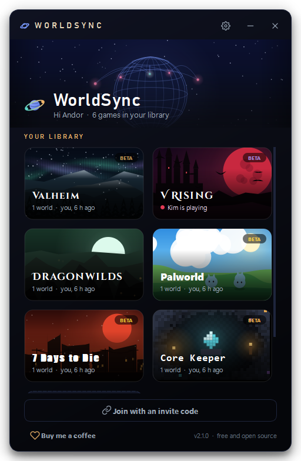
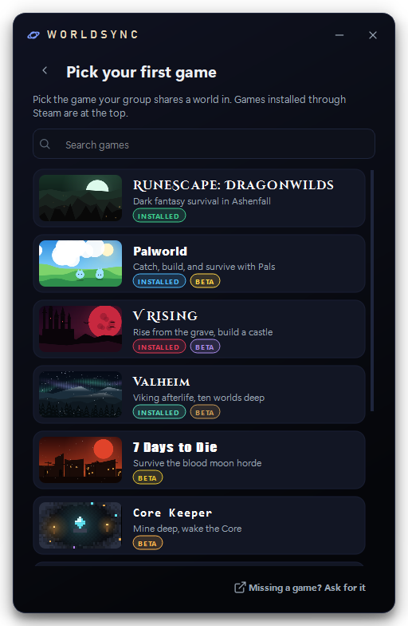
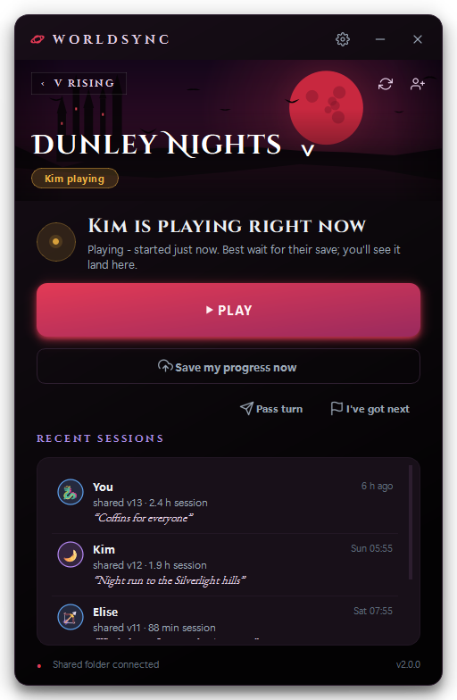
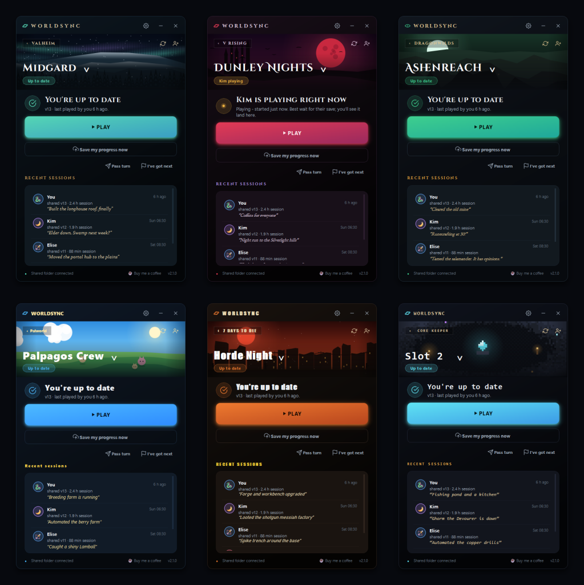
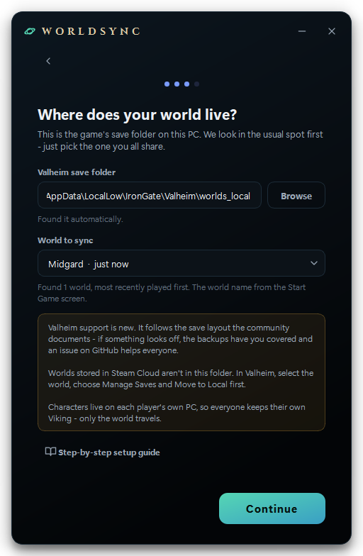
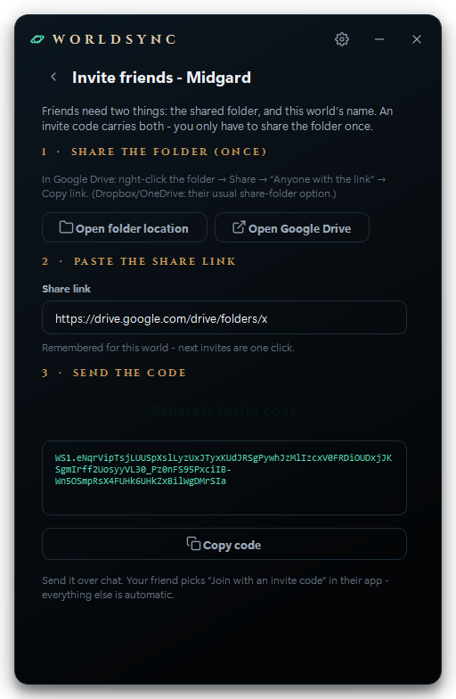
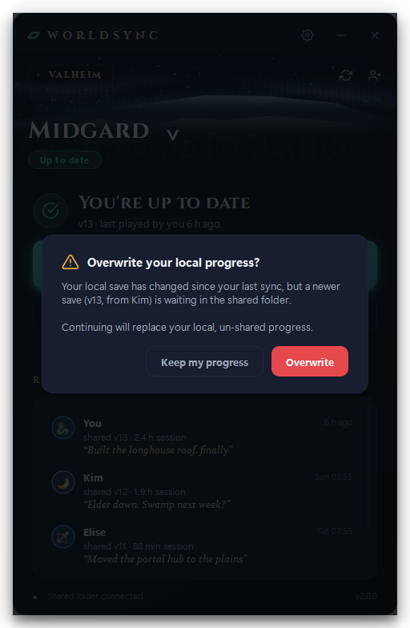

# WorldSync

[](https://github.com/AndorManu/worldsync/actions/workflows/tests.yml)
[](https://github.com/AndorManu/worldsync/releases/latest)
[](LICENSE)


**Your co-op world shouldn't live on one PC.**

In most survival games a world lives on the computer of whoever created it.
If that person isn't online, nobody else can play it. WorldSync moves the
world into a shared cloud folder instead, so **anyone in the group can
host**: tonight you, tomorrow a friend, next week you alone for an hour.
Whoever presses Play gets the newest save, and their progress goes back to
the group when they quit. No server, no subscription, nothing to keep
running. Free and open source ([tips welcome](https://ko-fi.com/andormanu)).

<p align="center">
  
  
  
</p>

## Supported games

| Game | Status | Good to know |
|---|---|---|
| RuneScape: Dragonwilds | Tested | Where WorldSync started. Also gets a Characters page. |
| Valheim | Beta | Worlds in Steam Cloud need *Manage Saves → Move to Local* first. Characters stay on each PC. |
| Enshrouded | Beta | If you use Steam Cloud saves, point WorldSync at `Steam\userdata` during setup. |
| Palworld | Beta | Palworld ties the host's character to the host's PC; the original host can look reset when someone else hosts. Everyone else keeps theirs. |
| Core Keeper | Beta | Worlds are stored by slot, so the group shares the same slot number. |
| Sons of the Forest | Beta | The host's inventory lives in the save, so whoever hosts carries it. |
| V Rising | Beta | Every vampire is stored per Steam account, so everyone keeps their own. |
| Grounded | Beta | Steam version only; Game Pass saves sit in a protected folder. |
| Raft | Beta | |
| 7 Days to Die | Beta | A random-gen map travels with the save the first time (a few hundred MB). |

Step-by-step setup for each game, and where its saves live: **[docs/GAMES.md](docs/GAMES.md)**
(the same guide is in the app, under the world menu).

**Beta** means the save layout comes from community guides and WorldSync's
own tests, but hasn't had a full season of real groups yet. Every overwrite
is backed up first, so a surprise costs you a restore, not a world. If a
game does something unexpected, [open an issue](https://github.com/AndorManu/worldsync/issues)
and it moves to Tested once it's proven. More games get added one by one -
[ask for yours](https://github.com/AndorManu/worldsync/issues/new?labels=game-request&title=Game+request:+).

<p align="center">
  
</p>

Every game has its own look: Valheim's aurora, V Rising's blood moon, a
pixel cave for Core Keeper, a wasteland skyline for 7 Days to Die. All of
it is drawn by the app itself; no game art is shipped.

### Isn't this what dedicated servers are for?

Yes, if your group plays together often enough to justify one. A dedicated
server needs a machine running 24/7 (yours, or roughly €5-15 a month rented)
and someone to keep it updated in step with the game. WorldSync is for the
other kind of group: three to five friends who play a couple of evenings a
week, rarely all at once, and don't want a bill or a box to maintain.
Nothing runs when nobody's playing; the world is just files in a folder you
already have. Steam Cloud doesn't cover this either - it syncs *your* saves
between *your* PCs, not between friends.

There are paid tools that do something similar through their own cloud.
WorldSync is free, the code is public, and your saves never touch anyone's
server but the cloud drive you already use.

## Download

Grab `WorldSync.exe` from the **[latest release](https://github.com/AndorManu/worldsync/releases/latest)**.
One file, no install, no Python, no account. Windows only.

SmartScreen will warn the first time because the exe isn't code-signed -
**More info → Run anyway**. The exe on every release is built by
[GitHub Actions](.github/workflows/release.yml) from the tagged source on a
clean runner, not on anyone's laptop; and if you'd rather not trust it at
all, build it yourself in two commands (see below).

**Coming from Dragonwilds Sync?** Just run WorldSync. Your worlds, settings,
backups and invite codes carry over on first start, and friends still on
Dragonwilds Sync 1.x can keep joining your Dragonwilds worlds.

## How it works

1. **Add a game.** The picker lists every supported game with the ones
   installed through Steam at the top.
2. **Pick the world.** WorldSync looks in the game's usual save folder and
   lists the worlds it finds, most recently played first, so you don't have
   to go digging through AppData.
3. **Pick a shared folder** inside a cloud drive every friend syncs to their
   own PC (Google Drive, Dropbox, OneDrive... it doesn't care which).
4. **Invite friends** with a code. It carries the game, the world and the
   folder, so joining is paste, click, done.

From then on:

- **Play** pulls the newest save, launches the game through Steam, and
  shares your progress back automatically once you close it.
- A small `version.json` in the shared folder tracks a version number, who
  played last and when. Every share bumps the version; every pull checks it.
- If your local save changed without being shared *and* a friend has since
  shared a newer one, you get a clear warning before anything is
  overwritten, in **both** directions. Whatever gets replaced is backed up
  first (browse and restore under *world menu → Backups*).
- The app shows **who's playing right now**, lets you call **"I've got
  next"**, pings you from the tray when it's your turn, and can post to a
  Discord/Slack/ntfy **webhook** when someone shares a save.
- Worlds that are whole folders (V Rising, Palworld, Raft...) sync as a
  whole, including autosaves the game rotates out, and WorldSync refuses to
  copy one game's world into another game's folder.

<p align="center">
  
  
  
</p>

**House rule:** one person plays at a time. The app warns loudly (before
*and* after the fact) if two sessions collide, but the polite fix is a
message in the group chat.

## Keeping everyone on the latest version

No store, no re-sending the exe: run the new build yourself, then
*Settings → Publish this version to friends*. Everyone else's app sees the
newer build in the shared folder, shows an **Update** bar, and swaps itself
in place on confirm. Worlds and settings are kept.

## Extras

- **Test my setup** (Settings) - a checklist for folders, cloud sync and
  game launch, so setup problems are obvious, not mysterious.
- **"Did it work?"** - after a game's first share, one click tells the
  maintainer whether it worked for you (only while reports are on).
- **Checkpoints** (world menu → Backups) - name a snapshot before something
  risky; restore it any time.
- **Group history** - the last few shared versions stay in the shared
  folder, so the whole group can roll back, not just whoever made a backup.
- **Pass the turn** - hand a specific friend the world; they get a tray ping.
- **Phone status page** - a `status.html` in the shared folder shows who's
  playing, readable from your phone's cloud-drive app.

## Building from source

```powershell
git clone https://github.com/AndorManu/worldsync.git
cd worldsync
.\build.ps1        # creates .venv, runs tests, builds dist\WorldSync.exe
```

Development:

```powershell
python -m venv .venv
.\.venv\Scripts\pip install -r requirements.txt -r requirements-dev.txt
.\.venv\Scripts\python -m app                # run from source
.\.venv\Scripts\python -m pytest tests      # the test suite
.\.venv\Scripts\python tools\screenshots.py # re-render docs/screenshots
```

## Adding a game

A game is a single entry in [`app/core/games.py`](app/core/games.py): where
it keeps its saves, how to tell worlds apart, which files make up a world,
and the exe to watch for. For example:

```python
GameProfile(
    id="raft", name="Raft", steam_app_id="648800",
    process_names=("Raft.exe",),
    save_roots=("{LOCALLOW}/Redbeet Interactive/Raft/User/User_*/World",),
    discover=(Discover("*", r"^(?P<w>[^/]+)$", dirs=True),),
    patterns=("{world}/**/*",),
    mirror=True,
)
```

Give it a theme in [`app/ui/gamethemes.py`](app/ui/gamethemes.py) and a
scene in [`app/ui/scenes.py`](app/ui/scenes.py), add a test, and open a PR.

## Layout

```
app/
  core/        sync protocol, game profiles, config schema, invites, presence,
               webhooks, backups, game launch/watch, Steam detection - no Qt
  ui/          library, picker, per-game themes and scenes, screens (PySide6)
  controller.py  worker threads in, Qt signals out
  main.py      entry point (--tray starts quietly in the tray)
tests/         pytest suite, including offscreen UI smoke tests
tools/         icon generator, screenshot harness
```

## Why it's built this way

The sync core is deliberately small and boring: a `version.json` manifest,
a monotonic version counter, and content fingerprints compared on **both**
pull and push. Every overwrite is preceded by a backup, and every manifest
write is atomic (temp file + rename), so a cloud client dying mid-sync can't
leave a half-written state. Games are plain data: the core never knows which
game it's syncing, it just gets a folder and a set of file patterns. Cloud
drives were chosen over a server on purpose - a group of friends already has
one, it's free, and there's nothing to host, patch or pay for.

Per-user data lives in `%APPDATA%\WorldSync\` (config, per-world state,
logs, safety backups). Older configs migrate automatically and the
originals are kept as `config.v1.bak` / `config.v2.bak`.

## Security notes, honestly

- **Anonymous reports are on by default, and one checkbox in Settings turns
  them off.** Apart from those, nothing leaves your PC except into the shared
  folder you chose. A report says which game,
  whether a share, pull or launch worked, the app version and Windows version,
  under a random id made on your PC. Never your name, world names, folders,
  invite codes or saves. It's how beta games get fixed and marked tested. The
  exact list of fields is in [`app/core/telemetry.py`](app/core/telemetry.py),
  and a test checks that nothing else gets through. No accounts. Webhooks and
  Discord presence are off unless you turn them on.
- **The shared folder is the trust boundary.** Anyone who can write to it can
  change the world save, and - because updates travel through the same
  folder - can publish an app update that everyone else's app will offer to
  install. Only share the folder with people you'd hand your save to anyway.
  The update bar always asks; it never auto-installs.
- **The exe isn't code-signed** (certificates cost money; this is a hobby
  project). Verify a release by building it yourself, or compare the exe's
  SHA-256 with the one printed in the GitHub Actions log of that release.
- **Save files are only ever replaced after a backup is written.**

## Troubleshooting

- **"Shared folder not found"** - your cloud client isn't running or the
  folder moved; fix the path in Settings.
- **The newest save "hasn't finished syncing"** - the manifest arrived before
  the save files; give the cloud client a few seconds and hit refresh.
- **No worlds found** - start the game once and create or load the world,
  then browse to the save folder if WorldSync still can't see it.
- **Joining: the folder never appears** - make sure you clicked *Add shortcut
  to Drive* (not just opened the link), and that Google Drive for desktop is
  running. "Browse for it manually" always works as a fallback.
- **Game never detected** - Steam sometimes takes ages; the app waits two
  minutes, then falls back to the manual save button.
- Logs: **Settings → Open log folder**.

## Contributing

Issues and pull requests are welcome, game requests especially. Keep the
sync core (`app/core/sync.py`) boring: any change there needs a test in
`tests/test_sync.py` or `tests/test_games.py`, and the manifest must stay
readable by older versions (it's plain JSON on purpose). Run
`python -m pytest tests` before opening a PR - CI runs the same suite on
Windows and Linux.

## Support

WorldSync is free and stays free. If it saved your group a server bill,
you can [buy me a coffee on Ko-fi](https://ko-fi.com/andormanu). It goes
straight into adding the next game.

## Credits & license

- Code: [MIT](LICENSE). Built by [AndorManu](https://github.com/AndorManu).
- Fonts: Cinzel, Cinzel Decorative and EB Garamond, under the
  [SIL Open Font License](app/assets/fonts/OFL-Cinzel.txt). Other typefaces
  are the ones that ship with Windows.
- Dragonwilds item and unlock tables (`app/assets/*.json`) are derived from
  the community datamine in [PEAKEGames/DWCharacterEditor](https://github.com/PEAKEGames/DWCharacterEditor).
- No game assets are shipped; every scene and icon is drawn by the app.
- All game names are trademarks of their respective owners. WorldSync is an
  independent fan-made tool, not affiliated with or endorsed by any of them.
